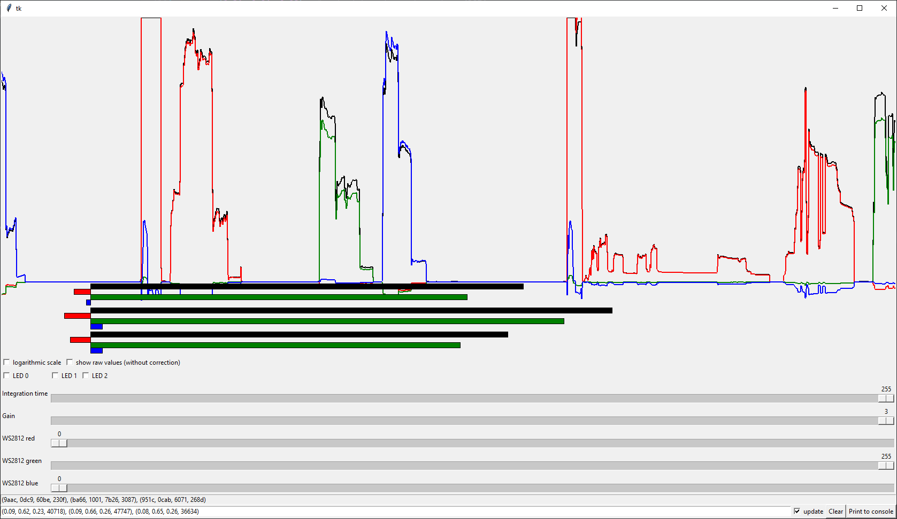
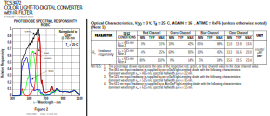
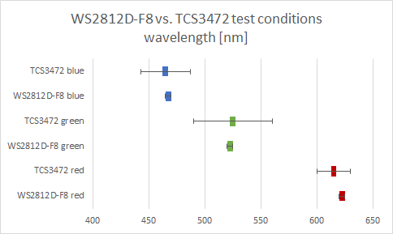
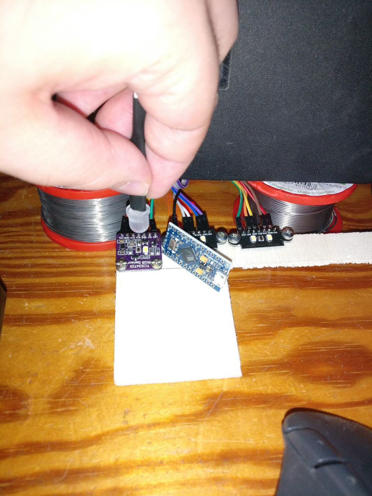
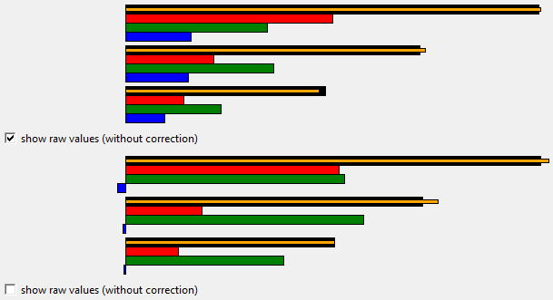

This repository contains code for evaluating the TCS3472 and - later - maybe compare it to other options, e.g. APDS-9960.

There are two ways to connect the sensor:

* `python3 tcs3472_ftdi.py`: One sensor connected to a Sipeed RV Debugger. I2C is done by bitbanging via USB so this is very slow. Don't use this unless you have to.
  * Need tkinter and pyftdi.
* `python3 tcs3472_arduino.py COMPORT`: Three sensors and one WS2812-F8 connected to an Arduino Pro Micro (ATmega32U4). See `src/main.cpp` for the firmware of the Arduino.
  * Need tkinter, pyserial and numpy.

Both have a simple tkinter GUI but the second one has more features.

Pinout (FTDI)
-------------

See [here](https://github.com/kprasadvnsi/tang-doc/releases/download/1.0.0/FT2232D.Schematic.pdf) for schematic of the [Sipeed RV Debugger](https://tang.sipeed.com/en/hardware-overview/rv-debugger/).
It is basically an FT2232 (but not the newer high-speed "H" version) and other FTDI based adapter will most likely work with minimal changes (e.g. change the connection URL in the script).

**Important**: TCS3472 come with I2C at 1.8V or VDD depending on their type. The instructions below are for board that have level shifters and a voltage regulator. Using the wrong voltage will most likely break things so pay attention to this.

* ADBUS0: JTAG_TCK -> SCL
* ADBUS1: JTAG_TDI -> SDA
* ADBUS2: JTAG_TDO -> also SDA  (optional, only used by FT2232H)
* ADBUS3: JTAG_TMS -> LED
* GND: GND
* 5V: VIN (assuming your board has a voltage regulator and level shifters)

The newer "H" series devices (e.g. FT2232H) have a better I2C mode, which should be much faster. This is not supported by the current code but it should be fairly easy to replace my `I2CBitbanging` class
by the I2C implementation in pyftdi. This will only support one sensor because their address is not configurable. Therefore, I recommend using the Pro Micro (or whatever Arduino-capable MCU you have around).

Pinout (Pro Micro)
------------------

See [here](https://cdn.sparkfun.com/datasheets/Dev/Arduino/Boards/Pro_Micro_v13b.pdf) for schematic of the Pro Micro but the [pinout drawing](https://learn.sparkfun.com/tutorials/pro-micro--fio-v3-hookup-guide/hardware-overview-pro-micro) is probably more useful.

Most of the pins can be changed at the top of `main.cpp` except for the first sensor (I2C0), which always uses the hardware I2C. This should work with any ATmega32U4 board that is supported by PlatformIO. Other controllers will also work but may need minimal changes, e.g. set a suitable speed for serial communication.

**Important**: TCS3472 come with I2C at 1.8V or VDD depending on their type. The instructions below are for board that have level shifters and a voltage regulator. Using the wrong voltage will most likely break things so pay attention to this.

* 2:  SDA of sensor 0
* 3:  SCL of sensor 0
* 4:  LED of sensor 0
* 5:  SDA of sensor 1
* 6:  SCL of sensor 1
* 7:  LED of sensor 1
* 14: SDA of sensor 2
* 16: SCL of sensor 2
* 10: LED of sensor 2
* A3: DIN (pin 4) of [WS2812D-F8](https://datasheet.lcsc.com/lcsc/1811021523_Worldsemi-WS2812D-F8_C139126.pdf)
* RAW (or VCC): "anode" (pin 2) of WS2812D-F8
* VCC: VIN of sensors (assuming your board has a voltage regulator and level shifters)
* GND: GND of sensors, "kathode" (pin 3) of WS2812D-F8

Color filter compensation
-------------------------

The color filters aren't perfect so the channels also react to other colors. This can be seen by Figure 2 in the [datasheet](https://cdn-shop.adafruit.com/datasheets/TCS34725.pdf):

The wavelengths of a WS2812D-F8 are quite close to the test wavelength in "Optical Characteristics" (to within 10 nm), which are presumably what the TCS was designed for. We should achieve similar
results.

Here is my test setup (the second one with more distance to not saturate the sensor at the high gain setting):

**FIXME**: insert bar graph with error bars for my measurements

We can measure which values the sensors report under red/green/blue illumination. We write them into a matrix, invert it (using numpy) and use that to calculate real values from measured values.
The sensors are slightly different and we use the same compensation so the result isn't perfect:

This is with the WS2812 set to full yellow (`#ffff00`) over the first sensor. The others see it at an angle, which reduces the amount of red for some reason1 (but this is consistent across measurements).
We can see that the false blue measurement is reduced to about zero. The smaller orange bar is the sum of the colors and it should be almost equal to the black bar (the one without any color filters).
This is actually slightly worse than with the uncalibrated values.

1 The LED also appears green to the eye when looking at the side rather than the front. However, the effect on the measurement seems to be less for the first sensor (the one baught at Ebay instead
      of AliExpress) so it seems that there is some additional directionality of the sensors at play.

License
-------

MIT for my code but libraries have other licenses (e.g. GPL) and it is based on the PlatformIO project template (PlatformIO uses an Apache license)
