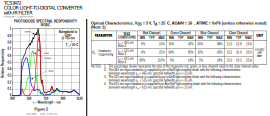
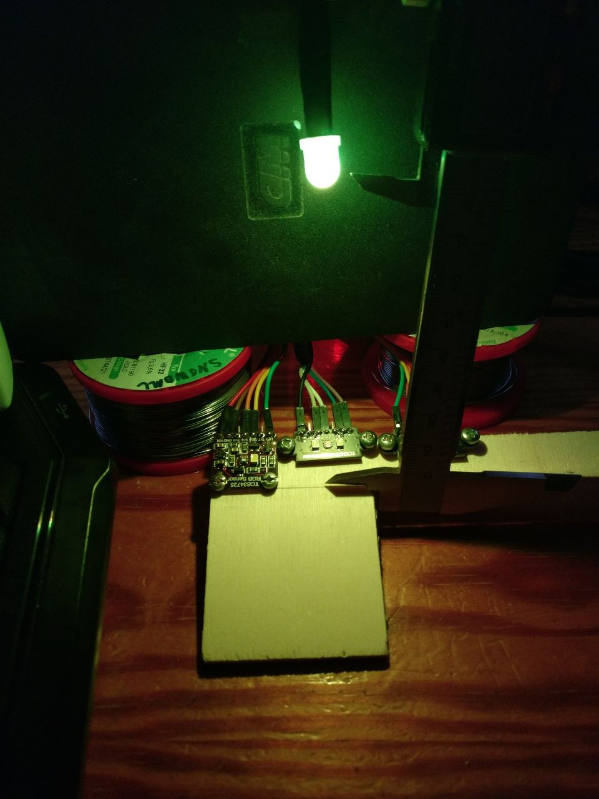

This repository contains code for evaluating the TCS3472 and - later - maybe compare it to other options, e.g. APDS-9960.

There are two ways to connect the sensor:

* `python3 tcs3472_ftdi.py`: One sensor connected to a Sipeed RV Debugger. I2C is done by bitbanging via USB so this is very slow. Don't use this unless you have to.
  * Need tkinter and pyftdi.
* `python3 tcs3472_arduino.py COMPORT`: Three sensors and one WS2812-F8 connected to an Arduino Pro Micro (ATmega32U4). See `src/main.cpp` for the firmware of the Arduino.
  * Need tkinter, pyserial and numpy.

Both have a simple tkinter GUI but the second one has more features.

Pinout (FTDI)
-------------

See [here](https://github.com/kprasadvnsi/tang-doc/releases/download/1.0.0/FT2232D.Schematic.pdf) for schematic of the [Sipeed RV Debugger](https://tang.sipeed.com/en/hardware-overview/rv-debugger/).
It is basically an FT2232 (but not the newer high-speed "H" version) and other FTDI based adapter will most likely work with minimal changes (e.g. change the connection URL in the script).

**Important**: TCS3472 come with I2C at 1.8V or VDD depending on their type. The instructions below are for board that have level shifters and a voltage regulator. Using the wrong voltage will most likely break things so pay attention to this.

* ADBUS0: JTAG_TCK -> SCL
* ADBUS1: JTAG_TDI -> SDA
* ADBUS2: JTAG_TDO -> also SDA  (optional, only used by FT2232H)
* ADBUS3: JTAG_TMS -> LED
* GND: GND
* 5V: VIN (assuming your board has a voltage regulator and level shifters)

The newer "H" series devices (e.g. FT2232H) have a better I2C mode, which should be much faster. This is not supported by the current code but it should be fairly easy to replace my `I2CBitbanging` class
by the I2C implementation in pyftdi. This will only support one sensor because their address is not configurable. Therefore, I recommend using the Pro Micro (or whatever Arduino-capable MCU you have around).

Pinout (Pro Micro)
------------------

See [here](https://cdn.sparkfun.com/datasheets/Dev/Arduino/Boards/Pro_Micro_v13b.pdf) for schematic of the Pro Micro but the [pinout drawing](https://learn.sparkfun.com/tutorials/pro-micro--fio-v3-hookup-guide/hardware-overview-pro-micro) is probably more useful.

Most of the pins can be changed at the top of `main.cpp` except for the first sensor (I2C0), which always uses the hardware I2C. This should work with any ATmega32U4 board that is supported by PlatformIO. Other controllers will also work but may need minimal changes, e.g. set a suitable speed for serial communication.

**Important**: TCS3472 come with I2C at 1.8V or VDD depending on their type. The instructions below are for board that have level shifters and a voltage regulator. Using the wrong voltage will most likely break things so pay attention to this.

* 2:  SDA of sensor 0
* 3:  SCL of sensor 0
* 4:  LED of sensor 0
* 5:  SDA of sensor 1
* 6:  SCL of sensor 1
* 7:  LED of sensor 1
* 14: SDA of sensor 2
* 16: SCL of sensor 2
* 10: LED of sensor 2
* A3: DIN (pin 4) of [WS2812D-F8](https://datasheet.lcsc.com/lcsc/1811021523_Worldsemi-WS2812D-F8_C139126.pdf)
* RAW (or VCC): "anode" (pin 2) of WS2812D-F8
* VCC: VIN of sensors (assuming your board has a voltage regulator and level shifters)
* GND: GND of sensors, "kathode" (pin 3) of WS2812D-F8

Color filter compensation
-------------------------

The color filters aren't perfect so the channels also react to other colors. This can be seen by Figure 2 in the [datasheet](https://cdn-shop.adafruit.com/datasheets/TCS34725.pdf):

The wavelengths of a WS2812D-F8 are quite close to the test wavelength in "Optical Characteristics" (to within 10 nm), which are presumably what the TCS was designed for. We should achieve similar
results.

Here is my test setup (the second one with more distance to not saturate the sensor at the high gain setting):

We can measure which values the sensors report under red/green/blue illumination. Here are the results for my three sensors versus the datasheet:

The third sensor is not as consistent as the others and the "G->G" value is even outside the range that is specified in the datasheet. The actual range in practice seems to be much small than indicated
by the datasheet but keep in mind that my sensors are from two lots only and I have tested at room temperature.

We write the values into a matrix (embedded in the diagram above). An ideal sensor would have 1's on the diagonal and zero everywhere else (i.e. no influence on other color channels). Our matrix isn't
too far from that but there is significant cross-talk between green and blue. This matrix goes from actual to measured values so we invert it (using numpy). The inverted matrix can be used to calculate
real values from measured ones.

The sensors are slightly different and we use the same compensation so the result isn't perfect:

This is with the WS2812 set to full yellow (`#ffff00`) over the first sensor. The others see it at an angle, which reduces the amount of red for some reason1.
We can see that the false blue measurement is reduced to about zero. The smaller orange bar is the sum of the colors and it should be almost equal to the black bar (the one without any color filters).
This is actually slightly worse than with the uncalibrated values.

1 This is consistent across measurements. The LED also appears green to the eye when looking at the side rather than the front. However, the effect on the measurement seems to be less
      for the first sensor (the one bought at Ebay instead of AliExpress) so there is some additional directionality of the sensors at play.

Measurements
------------

Here are some graphs of my first measurements for one LED and two monitors. The sensors report different maximum values - especially for the WS2812, where they have different distances and
angles - so I have normalized all channels to the value that was measured at full red/green/blue. The straight lines are the values that are output one the LED resp. monitor.

The WS2812 is looking good. This is in part because I have used the same LED to generate values for the compensation matrix so the value at full red/green/blue should be fairly perfect (except for differences
between the sensors because they all use the same matrix). However, you can see that the plateaus are not even. For example, red goes down quite a lot when the green LED ramps up. This means that the compensation
could be better.

Linearity is quite good with the WS2812 except for very small values. This is to be expected because the LED uses PWM and the sensor integrates over a longer time. PWM means that the LED will always use the maximum
current (or be off) and the sensor will see pulses that always have the same brightness (but will be longer or shorter). Therefore, we will get a linear result even if the color of the LED varies with current and
if the sensor doesn't have a linear response to different brightness because we only ever use the same current and brightness (but less or more often resp. shorter/longer depending on PWM duty cycle).

The monitors are more interesting. I assume that they also use PWM but the lines are curved. I think this is due to gamma correction and to match the color spectrum that the monitors are supposed to have.
In addition, we see a strong effect on other colors. For example, if green ramps up, blue will rise by 50%. I think this is to increase brightness and contrast.

In all the measurements, we see a significant difference for the red channel between the three sensors. However, this only occurs when there is a lot of green. I assume the influence of green light on the red
channel is quite different between those sensors and we could solve this by compensation matrices that are calibrated for individual sensors.

Just to convince you that compensation is a good idea despite the imperfections - here is a normalized graph with the raw values:

And here is one without normalization. You can see that the longer wavelengths (i.e. red) have lower plateaus although the sensor should be more sensitive to them. I assume this means that red is actually less
bright (which may be due to the angle).

Here is the same graph for the left monitor. Here, red is the strongest channel and green is lower by about the amount indicated in the datasheet. Blue should be at 10k but actually is at 8.5k, which may be due
to color temperature settings of the monitor:

For reference, here are the monitor settings: Brightness and contrast at 70, sharpness at 0, custom color temperature with r=100, g=78, b=82 for the left monitor and r=100, g=83, b=75 for the right one.
The different color temperature was chosen to match perceived color between those monitors.

| Monitor | full red | full green | full blue | green/red | blue/red | color temperature |
|---------|----------|------------|-----------|-----------|----------|-------------------|
| left    | 14152    | 12392      | 8544      | 88 %      | 60 %     | r=100, g=78, b=82 |
| right   | 16051    | 14938      | 9670      | 93 %      | 60 %     | r=100, g=83, b=75 |

This would indicate that I should reduce the green slider to 78 for the right monitor but this actually makes it noticably more red than the left monitor. I'm comparing the monitors in the middle so the angle
is slightly different - or maybe it is just make-believe and the monitors would look more similar with the same settings.

The values also indicate that the right monitor is too bright. The sensors were mounted to the monitors with tape and the Arduino was dangling from them so don't think the results are too trustworthy in that
domain. I have reduced the brightness a bit but if I reduce it as much as indicated by the measurements, it will be dimmer than the left monitor.

License
-------

MIT for my code but libraries have other licenses (e.g. GPL) and it is based on the PlatformIO project template (PlatformIO uses an Apache license)
